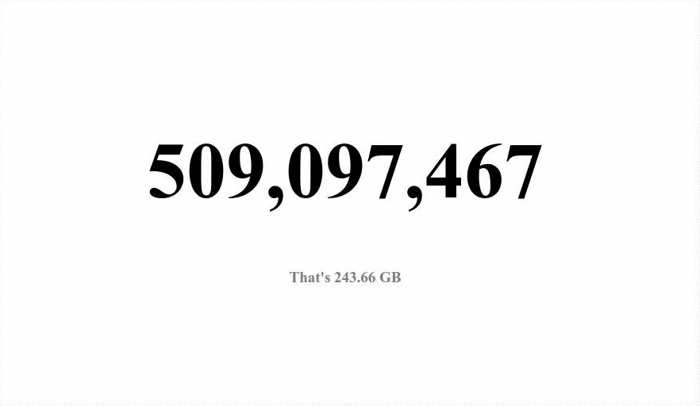

# MongoDB Live Count

A very simple web app showing the total number of documents in a MongoDB collection live and its storage size.
Count and storage size are updated every second.



### Get started
```bash
git clone git@github.com:draperunner/mongo-live-count.git
cd mongo-live-count
npm install
# Configure the app by setting environment variables. Defaults are shown below.
export DB_ADDRESS=127.0.0.1
export DB_PORT=27017
export DB=test
export COLLECTION=test
export PORT=4321 # Server port
```

Start server by running `node index.js`
